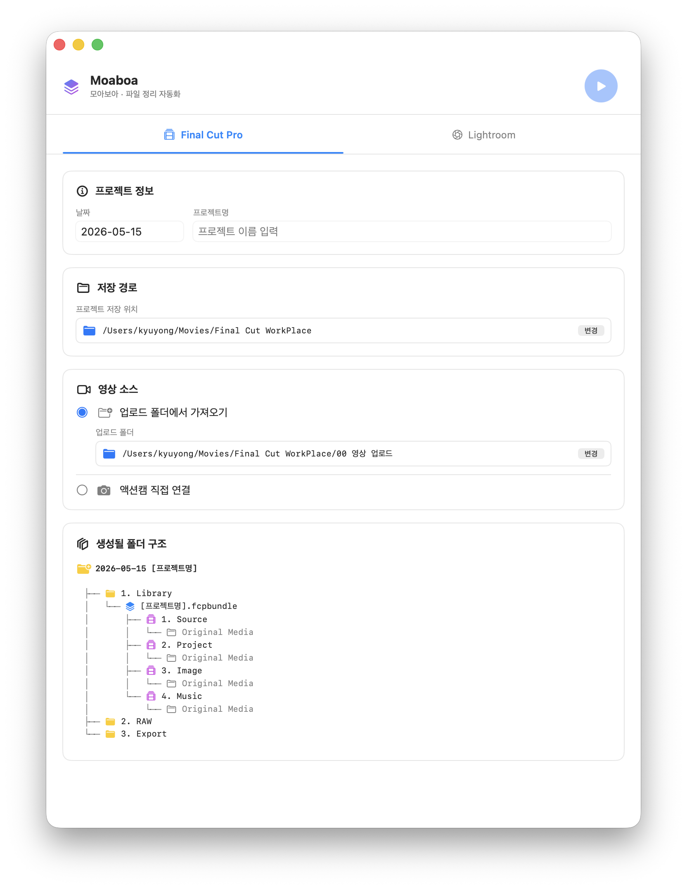

<div align="center">


# Moaboa (모아보아)

macOS 미디어 파일 정리 자동화 앱 — Final Cut Pro & Lightroom 워크플로우를 위한 네이티브 GUI 도구


</div>

---

## 어떤 앱인가요?

영상/사진 작업을 하다 보면 매번 같은 폴더 구조를 만들고, SD카드나 액션캠에서 파일을 옮기는 반복 작업이 생깁니다.  
**Moaboa**는 이 과정을 자동화합니다.

- 날짜와 프로젝트명만 입력하면 정해진 폴더 구조가 즉시 생성됩니다
- SD카드(Canon) 또는 액션캠(DJI Osmo Action)에서 파일을 자동으로 복사합니다
- **원본 파일은 삭제하지 않습니다** — 복사 후에도 SD카드/액션캠의 원본은 그대로 유지됩니다

---

## 스크린샷

<div align="center">
  
</div>

---

## 주요 기능

### Final Cut Pro 탭
- 날짜 + 프로젝트명 입력으로 FCP 작업 폴더 자동 생성
- Final Cut Pro 라이브러리(`.fcpbundle`) 및 이벤트 자동 생성
- 영상 소스 선택: 업로드 폴더 또는 액션캠 직접 연결
- **업로드 폴더** 사용 시 프로젝트 날짜와 파일 생성일이 일치하는 영상만 자동 필터링

```
📁 {날짜} {프로젝트명}/
  ├── 1. Library/
  │     └── 프로젝트명.fcpbundle
  ├── 2. RAW/
  └── 3. Export/
```

### Lightroom 탭
- 날짜 + 카탈로그명 입력으로 Lightroom 작업 폴더 자동 생성
- Canon SD카드 자동 감지 및 RAW 파일 복사

```
📁 {날짜} {카탈로그명}/
  ├── 1. Catalog/
  └── 2. RAW/
```

### 공통
- macOS 스타일 복사 진행 애니메이션 (Progress Bar + 파일 수 + 현재 파일명)
- 완료 시 체크마크 애니메이션
- 파일 미감지 시 경고 애니메이션
- 설정값 영속화 (앱 재시작 후에도 유지)

---

## 요구 사항

- macOS 13 Ventura 이상

---

## 설치 방법

### 소스에서 빌드

```bash
git clone https://github.com/Kyuyong/moaBoa.git
cd moaBoa
open Moaboa.xcodeproj
```

Xcode에서 빌드 후 실행하거나, `/Applications` 폴더에 복사해 사용합니다.

### 비공인 앱 첫 실행 시

Apple 코드사이닝 없이 배포된 경우 아래 과정이 필요합니다.

```
시스템 설정 → 개인정보 보호 및 보안 → '확인되지 않은 개발자' → 그래도 열기
```

---

## 버전 히스토리

| 버전 | 주요 변경 |
|------|-----------|
| v1.2 | FCP 업로드 폴더: 프로젝트 날짜 기준 파일 생성일 필터링 추가 |
| v1.1 | SD카드/액션캠 원본 보존, 복사 애니메이션 추가, DJI Osmo Action 기본 경로 설정 |
| v1.0 | 최초 릴리즈 — 쉘 스크립트에서 SwiftUI 앱으로 전환 |

---

## 라이선스

개인 프로젝트입니다. 별도 라이선스 명시 전까지 무단 배포를 제한합니다.
